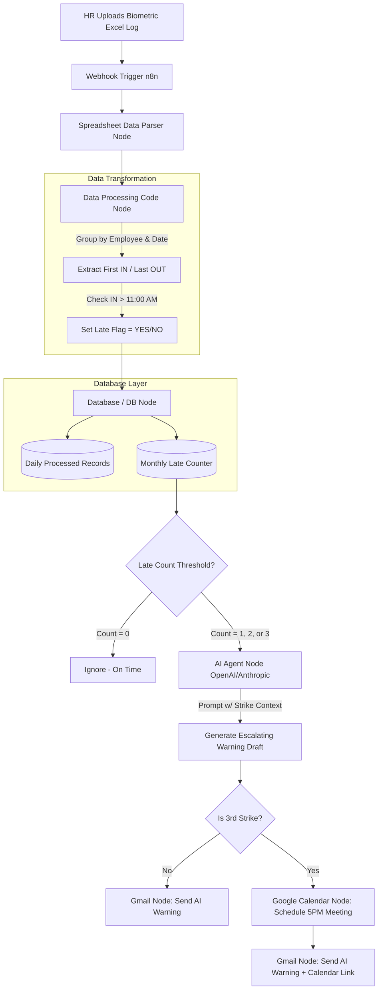
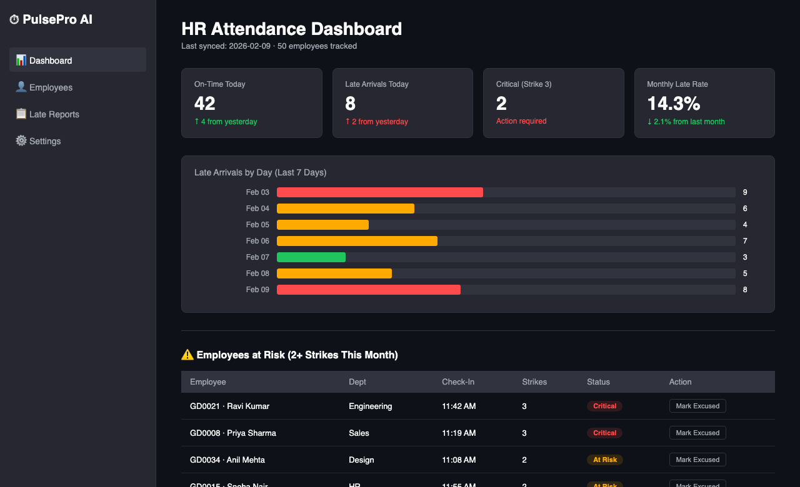
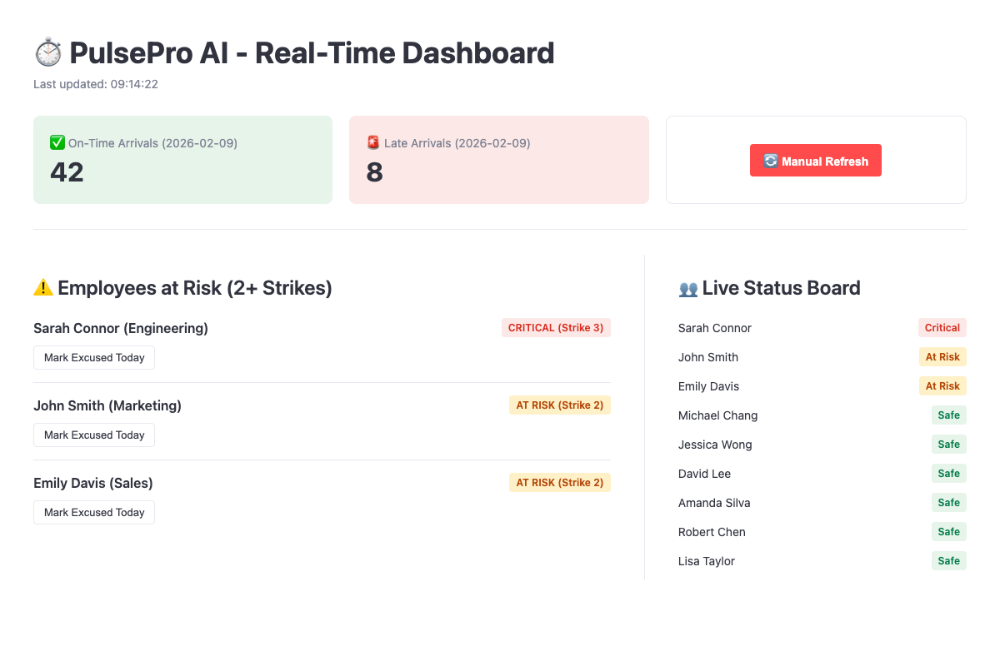
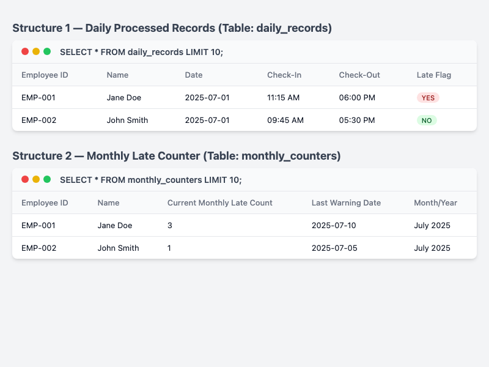
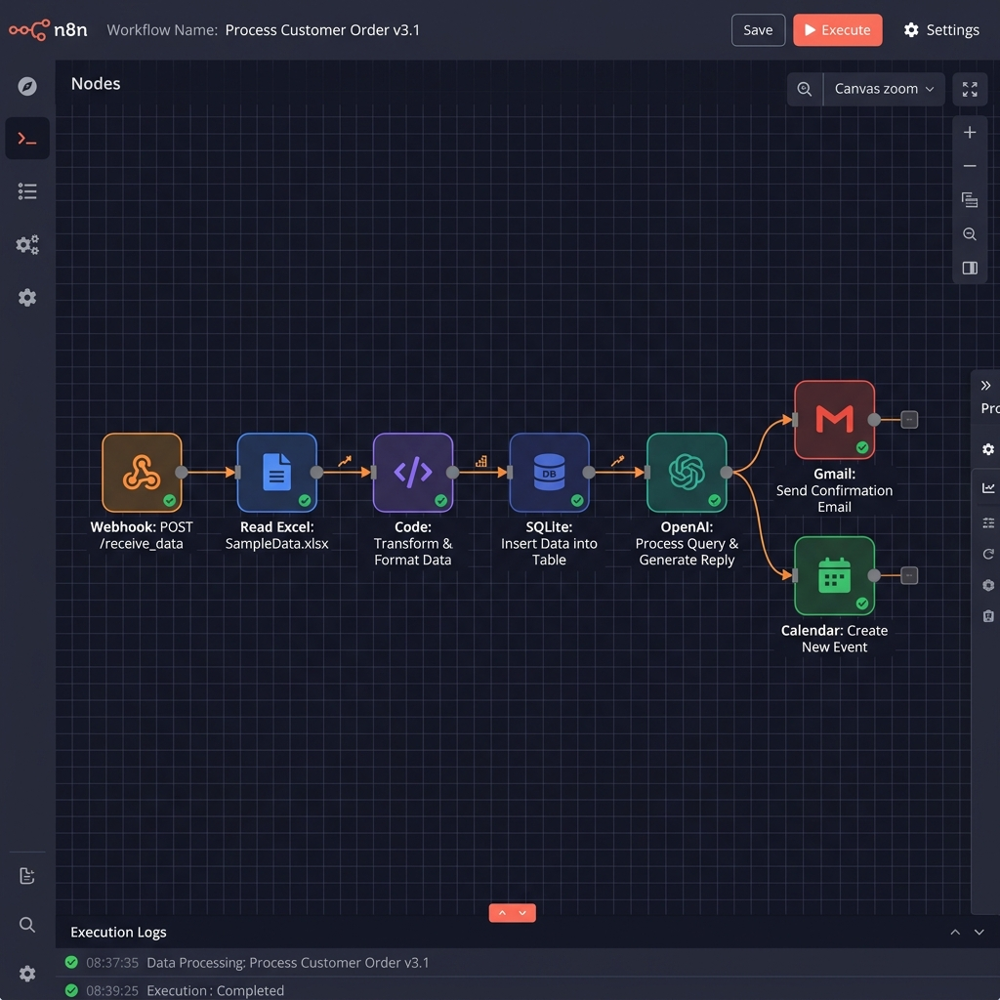

<div align="center">

# ⏱️ PulsePro AI: Automated HR Attendance Ecosystem

### Automated HR Attendance & Warning System

[](https://python.org)
[](https://n8n.io)
[](https://streamlit.io)
[](https://openai.com)
[](https://www.sqlite.org/)
[](https://pandas.pydata.org/)

**PulsePro AI is an automated HR workflow designed to process biometric punch logs and manage attendance policies. Built with n8n and Python, it identifies late arrivals, tracks a three-strike warning system, and automates employee communications.**

</div>

---

## 🌟 Project Overview
**PulsePro AI** automates the manual overhead of tracking late arrivals and managing warnings. It combines workflow orchestration (n8n) with a data dashboard (Streamlit) to provide real-time visibility into attendance patterns.

The system ingests biometric data, applies policy logic, maintains persistent records, and triggers automated emails.

### ❓ The Problem
In modern organizations, HR departments spend **5+ hours per week** manually checking Excel exports from biometric machines. Handling missing punches, tracking repeat offenders, and manually writing warning emails is error-prone and emotionally taxing. When employees slip through the cracks, workplace discipline degrades.

### 💡 The Solution
PulsePro AI automates the process:
- **Automated Data Normalization**: Custom Python logic flattens messy "Muster Roll" exports into clean, queryable analytics data.
- **Rule-Based Enforcement**: Automatically detects any Check-In after **11:00 AM** and flags it as a "Late Arrival".
- **Automated Communication**: Uses OpenAI to generate personalized warning emails based on the employee's strike count, with automated scheduling for mandatory reviews.

---

## 🛠️ Complete Tech Stack & Deep Details

### 1. The Workflow Orchestrator (n8n)
*   **Pipeline Engine**: Uses **n8n** (Cloud/Self-Hosted) to manage the entire data ingestion and escalation lifecycle.
*   **Triggers**: Initiated instantly via a Webhook file upload of the daily biometric CSV.
*   **Google Workspace Integrations**: Automatically interfaces with the Gmail API and Google Calendar API to dispatch personalized warnings and secure 5:00 PM meeting slots.

### 2. Escalation Logic (OpenAI)
*   **AI Agent Node**: Connects to the OpenAI API to draft contextually appropriate communications.
*   **Dynamic Prompting**: The prompt injects the employee's specific late count (Strike 1, 2, or 3). The AI adjusts its tone from a polite reminder to a stern, final warning demanding a formal meeting.

### 3. Business Intelligence Dashboard (Streamlit)
*   **Interface**: A real-time web dashboard built with **Streamlit**.
*   **Risk Analysis**: Color-codes employees as Safe, At Risk, or Critical based on their monthly strikes.
*   **Manual Overrides**: Features an integrated "Mark Excused" button allowing admins to dynamically clear a late flag if an employee had prior approval, instantly updating the database.

### 4. Data Persistence (SQLite)
*   **Database**: **SQLite3** persistence layer.
*   **Schema**: Two highly structured tables: `daily_records` (tracking specific IN/OUT punches) and `monthly_counters` (tracking aggregate strikes).
*   **Data Integrity**: Gracefully handles missing "OUT" punches by defaulting missing states and isolating anomalies.

---

## 🏗️ Detailed Project Architecture



---

## 📸 Visual Intelligence Gallery

<div align="center">
  
| **Executive Dashboard UI** | **Real-Time Analytics** |
|:---:|:---:|
|  |  |
| *Streamlit HR dashboard with employee risk monitoring* | *Late arrival tracking with manual excusal controls* |

| **Database Schema Engine** | **Workflow Automation** |
|:---:|:---:|
|  |  |
| *Structured Daily/Monthly Logging* | *Event-Driven Node Architecture* |

</div>

---

### Business Logic Flow
1.  **Ingestion**: Webhook receives the `Attendance_Report_Sheet.csv`.
2.  **Transformation**: Python/Node scripts flatten and group the data by Employee ID and Date.
3.  **Validation**: Earliest punch = Check-In. Latest punch = Check-Out. Check-In > 11:00 AM triggers the Late Flag.
4.  **Persistence**: Data is committed to `pulsepro.db`.
5.  **Escalation**: Monthly counters are incremented.
6.  **Action**: OpenAI drafts the email. If Strike 3, Google Calendar is booked, and Gmail dispatches the notice.

---

## 📁 Codebase Hierarchy

```text
PulsePro AI/
├── n8n_workflow.json          # Orchestration: The complete export of the n8n pipeline
├── dashboard/
│   ├── app.py                 # Streamlit: Entry point for the Live Web Interface
│   ├── init_db.py             # Database: SQLite initialization & Schema definitions
│   ├── convert_data.py        # Pipeline: Converts messy Muster Rolls into clean CSVs
│   ├── advanced_insights.py   # Analytics: AI pattern detection (e.g. "always late on Mondays")
│   ├── pulsepro.db            # Persistent Storage: Local CRM
│   └── requirements.txt       # Manifest: Python dependencies
├── assets/                    # Assets: High-res UI mockups and diagrams
├── README.md                  # Documentation: Primary repository guide
└── Attendance_Report_Sheet.csv# Test Data: Cleaned sample for webhook ingestion
```

---

## 🚀 Installation & Execution

### 1. Run the Live Streamlit Dashboard
```bash
git clone https://github.com/AayushTripathi07/PulsePro-AI.git
cd "PulsePro-AI/dashboard"

# Install dependencies
pip install -r requirements.txt

# Initialize the database (Seeds data from CSV)
python init_db.py

# Launch the Dashboard
streamlit run app.py
```

### 2. Import the Automation Engine
1. Launch your **n8n** instance.
2. Select **Workflows** > **Add Workflow**.
3. Click **Import from File** in the top-right corner.
4. Upload `n8n_workflow.json`.
5. Authenticate your Google Workspace and OpenAI credentials.

---

## 🗺️ Future Roadmap: Enterprise Scalability
While this version easily handles dozens of employees, scaling PulsePro AI to **500+ employees across 5 global office locations** is the next phase:
- **Distributed Queuing (RabbitMQ)**: Buffering massive daily CSV uploads to prevent n8n memory overload.
- **Location-Aware Logic**: Implementing dynamic late thresholds (e.g., 09:30 AM for London, 11:00 AM for New York) based on employee metadata.
- **Biometric API Webhooks**: Bypassing Excel entirely by receiving live API pings directly from the fingerprint scanners as employees walk through the door.

---

<div align="center">

**Project by: Aayush Tripathi**

[GitHub](https://github.com/AayushTripathi07) • [LinkedIn](https://www.linkedin.com/in/aayush0712/)

</div>
